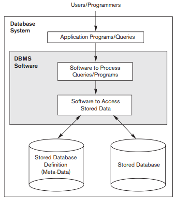
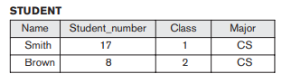
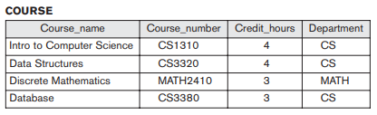
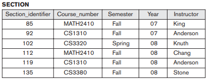
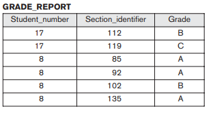
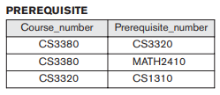

## Introdução a Banco de Dados

- Introdução
- Exemplo
- Características
- Atores
- Pessoal de Suporte
- Vantagens
- Quando não usar SGBD

## Introdução: conceitos básicos

- Um banco de dados é uma coleção de dados relacionados.
- Dados? $\rightarrow$ fatos que podem ser registrados (armazenados) e que têm
  algum significado implícito. Por exemplo: nomes, números telefônicos, ...
- A definição acima é muito genérica, em geral entendemos que um banco de dados
  tem 3 propriedades:
  1. Um banco de dados representa alguns aspectos do mundo real chamado de: **minimundo** ou de **universo de discurso** \(**UoD**\);
  2. Um banco de dados é uma coleção de dados *logicamente coerente* com algum significado inerente; e
  3. Um banco de dados é projetado, construído e *populado* \(preenchido, *populated*\) com dados para uma finalidade específica. Ele objetiva um grupo de pessoas \(usuários\) e aplicações.

Um banco de dados tem uma fonte da qual os dados são obtidos, algum tipo de interação com os eventos no mundo real e uma audiência que está ativamente interessada em seu conteúdo.

## Introdução: banco de dados

- Um banco de dados \(DB, *database*\) pode ter qualquer tamanho ou complexidade. Por exemplo:
  + uma agenda com nomes e números telefônicos tem uma estrutura simples e algumas centenas de registros;
  + um catálogo de obras de uma grande editora tem milhôes de livros, revistas, apostilas, ...
  + o banco de dados da Receita Federal é enorme. Com dados de contribuintes, Empresas, ...
  + o banco de dados da Amazon tem 20 milhões de livros, CDs, vídeos, DVDs, ...
- Um banco de dados pode ser gerado e manipulado manualmente (uma agenda) ou através de programas.
- Um banco de dados gerido computacionalmente utiliza uma série de programas \(ferramentas\) para criar e manipular os dados.

## Introdução: SGBD

- Um **SGBD**, Sistema de Gerenciamento de Banco de Dados \(**DBMS**, database management system\) é uma coleção de programas que permite aos seus usuários criar e modificar seus bancos de dados.
- SGBD é um software de sistema de uso geral que facilita os processos de:
  - definição
  - construção
  - manipulação e
  - compartilhamento

de bancos de dados entre vários usuários e aplicações.

- Outras funções importantes para SGBDs são proteção e manutenção do banco de dados por longos períodos.
- Por simplicidade, chamaremos o banco de dados e o SGBD de **Sistema de Banco de Dados**. A figura a seguir mostra um sistema de banco de dados simples.
<!--
- Mantive a figura em inglês para ir acostumando com os termos em inglês que encontraremos frequentemente nas documentações dos programas. Devo chamar a atenção de vocês para o termo "**query**" que pode ser traduzido como "consulta", mas que na área de banco de dados significa tanto leitura de dados, quanto manipulação dos dados. Poderia ser entendido como um *pedido* ao SGBD.
-->

##

## Exemplo

- Veremos a seguir um exemplo simples de um banco de dados para uma universidade. O BD da Universidade guarda informações sobre os alunos, disciplinas e notas.
- As figuras a seguir ilustram o banco de dados. Existem 5 *arquivos* de dados.
- O arquivo STUDENT armazena dados dos alunos.
- O arquivo COURSE armazena cada disciplina.
- O arquivo SECTION armazena cada vez que uma disciplina é ministrada.
- O arquivo GRADE_REPORT armazena as notas que os alunos receberam nas disciplinas cursadas.
- O arquivo PREREQUISITE armazena os pré-requisitos de cada disciplina.

##

##

##

##

##

## Características do uso de Banco de dados

- Os dados de um SBD poderiam ser simplesmente armazenados num arquivo, mas existem vantagens de se usar um SGBD:
  - A Natureza autodescritiva dos Sistemas de Bancos de Dados
  - Isolamento entre programas, dados e abstração de dados
  - Suporte a múltiplas visões  dos Dados
  - Compartilhamento de dados e processamento de transações de múltiplos usuários.

## Atores no cenário

- Administradores de Bancos de Dados
- Projetistas de Bancos de Dados
- Usuários finais:
  - usuário final ocasional
  - usuário final paramétrico ou iniciante
  - usuário final sofisticado
  - usuário autônomo
- Analistas de Sistema e Programadores de Aplicações (Engenheiros de Software)

## Trabalhadores atrás do palco

- Projetistas e implementadores de sistemas SGBD
- Desenvolvedores de ferramentas
- Operadores e pessoal de manutenção

## Vantagens de Usar SGBD

- Controle da Redundância
- Restrição de Acesso Não Autorizado
- Fornecer Armazenamento Persistente para Objetos de Programas
- Fornecer Estruturas de Armazenamento e Técnicas de Busca Para Processamento Eficiente de Consultas \(*Queries*\)
- Fornecer Backup e Recuperação
- Fornecer Múltiplas Interfaces de Usuários
- Representar Relacionamentos Complexos entre os Dados
- Forçar Restrições
- Permitir Inferências e Ações Baseadas em Regras

## Outras Implicações do Uso de Banco de Dados

- Potencial para Seguir Padrões
- Tempo de Desenvolvimento de Aplicações Reduzido
- Flexibilidade
- Disponibilidade de Informações Atualizadas
- Economia de Escala

## Quando Não Usar um SGBD

Existem umas poucas situações em que o custo de um SGBD não se justifica e é melhor usar um processamento de arquivos.

- Alto investimento inicial em hardware, software e treinamento.
- A generalização que um SGBD fornece para a definição e processamento dos dados não é desejável ou necessária.
- Superposição no provimento de segurança, nas funções de controle de concorrência, recuperação de dados e integridade de dados.

Portanto, é melhor usar processamento de arquivos quando:

- Em aplicações de banco de dados simples e bem definida que não sofrerá modificações.
- Requerimentos de tempo real são muito estritos para algumas aplicações que não podem *esperar* pelo processamento do SGBD.
- Sistemas embarcados com capacidade limitada de armazenamento e processamento.
- Não existe acesso múltiplo de usuários aos dados.

## Questões

1. Defina os seguintes termos: dados, banco de dados, SGBD, independência dado-programa, visão usuário, DBA, usuário final, meta dado e aplicação processadora de transação. (Alguns destes termos não foram vistos com detalhes na aula, procure na internet os detalhes ausentes e procure definir os termos de modo que, se você tiver uma dúvida sobre o termo daqui a 3 meses, a definição vai ajudá-lo a entender)

2. Quais são os 4 principais tipos de ações envolvidos num banco de dados? Discuta cada ação.

3. Pesquise quais são as diferenças entre um Sistema de Banco de Dados e um Sistema de Recuperação de Informação

## Exercícios

4. Identifique algumas consultas informais e operações de modificação que podem ser feitas ao banco de Dados do exemplo.

5. Especifique os relacionamentos entre os registros do banco de dados do exemplo.

6. Cite alguns exemplos de restrições de integridade que podem ser aplicadas ao banco de dados do exemplo.

7. Considere o exemplo:
  a. Se o nome do departamento muda-se de CS \(*Computer Science*\) para CSSE \(*Computer Science and Software Engineering*\), identifique as colunas do banco de dados que teriam de ser modificadas.
  b. Você consegue propor uma mudança na estrutura do BD para que apenas uma coluna fosse modificada?
