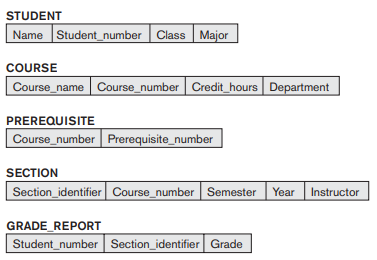
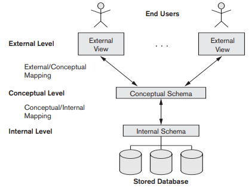
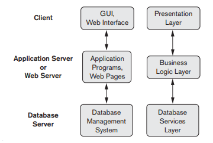

# Banco de Dados

## Introdução a SQL

Nesta aula veremos um resumo do capítulo 2 do livro texto e começaremos a usar um banco de dados e a interagir com o banco de dados da Oracle usando SQL. Para tanto, vamos criar uma conta na Oracle, acessar o banco de dados aberto da Oracle pela URL https://livesql.oracle.com.

- Esquemas em BD
- SGBDs: linguagens e arquiteturas
- Prática de SQL com https://livesql.oracle.com

## Schema do BD exemplo da aula passada

## Arquitetura de 3-esquemas e Independência de Dados

## Arquitetura de 3-esquemas

1. **Esquema Interno** - armazenamento físico do BD.
2. **Esquema Conceitual** (Nível conceitual) - descreve a estrutura de todo o banco de dados para a comunidade de usuários.
3. **Esquema Externo** - visão do usuário externo (final).

## Independência de Dados

1. Independência de Dados Lógica
2. Independência Física de Dados

## Linguagens de SGBD

- **DDL** (*Data Definition Language*): linguagem de definição de dados. O DBA e os projetistas de banco de dados usam para definir os esquemas conceitual e interno. Em alguns SGBDs, a DDL só é usada para definir o esquema Conceitual
- **DML** (*Data Manipulation Language*): linguagem de manipulação de dados.
  - DML de alto Nível
  - DML de **baixo nível**, ou **procedural**.
- SQL é tanto DDL, quanto DML de alto nível.

## Interfaces do SGBD

- Interface Baseada em Menus para Clientes Web ou Navegação
- Interface Baseada em Formulários
- Interface Gráfica para Usuários
- Interface de Linguagem Natural
- Interface para Usuários Parametrizáveis

## Arquiteturas de SGBDs

- Arquitetura Centralizada: Mainframe e terminais de comunicação
- Arquitetura Clientes/Servidor (duas camadas)
- Arquitetura Cliente/Servidor 3 camadas para Aplicações Web

## Acesso a um Banco de Dados: Oracle

1. Acesse a página: https://login.oracle.com/mysso/signon.jsp
2. Crie uma conta (clique em Create Account)
3. Forneça o seu email como nome de usuário
4. Forneça uma senha com uma mistura de letras maiúsculas, minúsculas e dígitos.
5. O sistema envia um email para você, abra o email e clique o link que ele fornece para confirmar sua abertura de conta.
6. Vá para o site: https://livesql.oracle.com
7. Comece uma sessão
8. Vamos fazer o que pede o Tutorial de Introdução a SQL

## Exercícios

1. Crie as 5 tabelas da aula passada
2. Insira os dados das figuras da aula passada
3. Verifique se as tabelas têm os dados corretos
4. Insira novos Dados
5. Que tipo de Interface podemos dizer que temos no site livesql.oracle.com?
5. Procure listar quais outras operações você gostaria de fazer com o banco de dados. Dê um nome para cada operação e descreva o que ela deve ser capaz de realizar. Guarde a listagem para nas próximas aulas vermos quais comandos de SQL permitem fazer o que você deseja.
