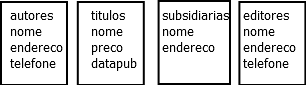
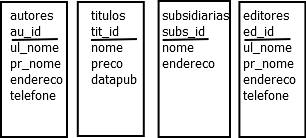

## BD bookbiz: Projeto das tabelas



- Na aula passada fizemos uma escolha preliminar de *Entidades* para nossa pequena editora. Precisamos selecionar as **chaves primárias** para as tabelas. Para a tabela de `autores`, poderíamos pensar em usar o nome como chave primária, mas nomes de pessoas são péssimas chaves, pois ________________ .

## Nomes

- Além disso, nomes são complicados e em muitas ocasiões, é importantes distinguir o nome de família das pessoas do nome. Como, geralmente, o último nome é o nome da família, dividimos a coluna `nome` em `ul_nome` e `pr_nome`.


## Escolha de **Chaves Primárias**



A chave primária para autores e editores pode ser CPF, mas não temos identificadores únicos naturais para títulos e subsidiárias. Podemos usar uma coluna com um valor único gerado internamente, como no tutorial da Oracle. No lugar o CPF também podemos usar um valor criado internamente. As chaves primárias são sublinhadas no diagrama.

## Relacionamento um-para-muitos

- O projeto ainda não está representando relacionamentos importantes entre as entidades.
- Comecemos pelo relacionamento entre as subsidiárias e os livros. Cada livro é publicado por uma única subsidiária, cada subsidiária publica vários livros. Este é um relacionamento um-para-muitos, 1-para-N, ou **1:N**.
- Primeira tentativa, colocar a informação do livro na tabela das sublinhadas.


## Corrigindo o relacionamento 1:N

- Do jeito que foi feito, cada vez que se incluir um novo livro para uma subsidiária, vamos ter de acrescentar uma entrada na tabela de livros e outra na tabela de subsidiárias.
- Uma maneira melhor de colocar este relacionamento é colocar a informação da subsidiária na tabela de livros.


## Relacionamento **muitos-para-muitos** (**N:N**)

- Algumas entidades têm um relacionamento muitos-para-muitos, N:N.
- Por exemplo, autores escrevem muitos livros. Alguns livros são o resultado criativo de muitos autores.
- No modelo relacional, relacionamentos N:N são representados por tabelas separadas.

##


## Resumo

1. Represente cada entidade independente (livro, autor, subsidiária, editor, empregado, departamento, aluno, disciplina, professor, ...) como uma tabela de base.
2. Represente cada propriedade de uma entidade (endereço, preço, ...) como uma coluna da tabela da entidade.
3. Certifique-se de que cada tabela tem uma chave primária. A chave pode ser uma propriedade, um valor artificial (interno), ou uma combinação de duas ou mais propriedades.
4. Localize os relacionamentos de um-para-muitos nas tabelas. Verifique que há uma coluna com uma chave estrangeira na tabela de *muitos* para a tabela de *um*.
5. Represente cada relacionamento muitos-para-muitos (chamado de associação)como uma **tabela de conexão** entre as duas tabelas que participam da associação. As chaves estrangeiras da tabela de conexão servem de chave primária.

## Restante das tabelas


## Comando `delete`

### Para apagar todos os dados de uma tabela

```SQL
delete from <nome_da_tabela>
```

### Para apagar dados selecionados da tabela

```SQL
delete from <nome_da_tabela>
  where
  <condição_que_a_linha_deve_atender>
```

## Clausura `where`

- A clausura `where` é usada para dar a condição que a linha deve atender para ser selecionada.

### Exemplo

```SQL
select * from autores where nome like 'José %'
```

Seleciona todos os autores cujo nome começa com 'José '. O `%` quer dizer qualquer sequência de caracteres (i.e., qualquer coisa). O `like` compara *strings*.

## Comando `drop table`

- Para apagar uma tabela com, ou sem dados, de um banco de dados, o comando é:

```SQL
drop table <nome_da_tabela>
```

> Cuidado com o comando.
