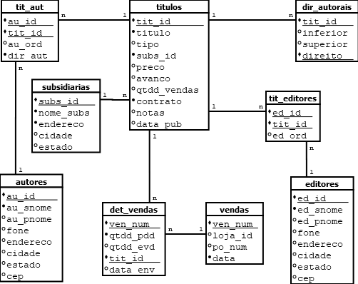

## Regras de normalização

- Existem inúmeras regras de normalização para o projeto de banco de dados.
- As regras estão ordenadas, você só aplica a regra 2 se já aplicou a regra 1.
- As regras objetivam reduzir (controlar) a redundância nas tabelas e garantir uma melhor lógica de acesso aos dados.
- Ao seguir as normas, em geral, você vai dividir as tabelas em duas ou mais tabelas com uma quantidade menor de colunas e criar relacionamentos chave primária-estrangeira que permitirá a operação de *join* das tabelas.

## Primeira Forma Normal

> Na intersecção de cada linha-coluna deve existir um e apenas um valor, este valor deve ser atômico.

Situação: A tabela de vendas, podemos não vender um único título. Aí, teríamos uma coluna com vários valores ou teríamos de ter mais colunas para cada título de uma venda. Solução: criação de uma tabela de detalhamento da venda com uma linha para cada título da mesma venda. Cuidado, parece, e é, um relacionamento 1 para muitos (uma venda, muitos títulos (detalhes)).

## Segunda Forma Normal

> Toda coluna que não seja uma chave deve depender da chave primária inteiramente.

Situação: esta é a situação de quando temos uma chave primária múltipla e um campo depende de uma parte da chave primária, mas não dela toda. Esta situação acontece com a coluna de `contrato` na tabela tituloautores. O contrato só depende do título e não dos autores.

## Terceira Forma Normal

> Nenhuma coluna não chave depende de uma outra coluna não chave.

Situação: é uma generalização da regra 2, toda coluna só pode depender da chave primária e não de outra coluna. No exemplo, temos problemas com a ordem do autor e seus direitos autorais. Estes não são dados do autor, dependem da obra.

## Quarta Forma Normal

> É proibido ter relacionamentos um-para-muitos independentes entre chaves primárias e colunas não chaves.

## Quinta Forma Normal

> Esta regra leva ao extremo as anteriores quebrando as tabelas nos menores pedaços possíveis para eliminar todas as redudâncias.

Ao aplicar esta normalização, as tabelas praticamente têm apenas seus dados essenciais.

## Banco de dados bookbiz

