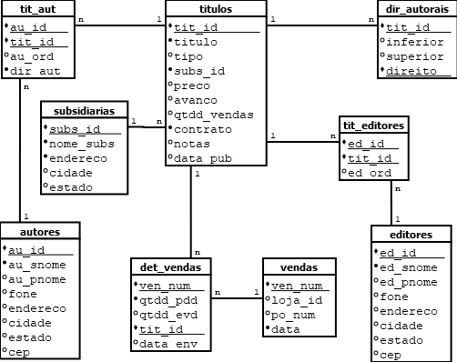

## Implementação do BD bookbiz



## Criação das tabelas das Entidades

- Olhando para o diagrama do BD `bookbiz` crie as tabelas `autores`, `editores`, `subsidiarias`, `titulos` e `vendas`.
- Insira dados para ir testando.


## autores


##

```SQL
create table autores (
	au_id number,
	au_snome varchar2(20) not null,
	au_pnome varchar2(80),
	fone varchar2(16),
	endereco varchar2(80),
	cidade varchar2(16),
	estado char(2),
	cep char(8),
	constraint autores_pk primary key(au_id)
);
```

### Teste
```SQL
insert into autores values (42, 'Silva', 'Jose da', '+55 11 454545', 'rua boa vista, 555', 'São Paulo', 'SP', '01000000');

select au_pnome, au_snome, fone as Telefone from autores;
```

### editores


