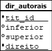

## tit_editores (finalizando aula7)


## Código

```SQL
create table tit_editores (
  ed_id number,
  tit_id number,
  ed_ord number(2),
  constraint tit_editores_pk primary key(ed_id, tit_id),
  constraint tit_editores_fk1 foreign key(ed_id) references editores,
  constraint tit_editores_fk2 foreign key(tit_id) references titulos
);

insert into tit_editores values (42, 1, 1);

select * from tit_editores;
```

## det_vendas


## Código

```SQL
create table det_vendas (
  ven_num number,
  qtdd_pdd number(3),
  qtdd_evd number(3),
  tit_id number,
  data_env date,
  constraint det_vendas_pk primary key(ven_num, tit_id),
  constraint det_vendas_fk1 foreign key(tit_id) references titulos,
  constraint det_vendas_fk2 foreign key(ven_num) references vendas
);

insert into det_vendas values (6565, 5, 3, 1, '2020-09-23');

insert into det_vendas values (6566, 2, 2, 1, '2020-09-30');

select * from det_vendas;
```

## dir_autorais



## Código

```SQL
create table dir_autorais (
  tit_id number,
  inferior number(7),
  superior number(7),
  direito number(5,2),
  constraint dir_autorais_pk(tit_id, direito),
  constraint dir_autorais_fk foreign key(tit_id) references titulos
);

insert into dir_autorais values (1, 101, 1000, 5.00);
insert into dir_autorais values (1, 1001, 10000, 7,00);

select * from dir_autorais;
```

## Insert e Update

- As instruções do SQL para inserir dados e modificar dados num BD são: **`INSERT INTO`** e **`UPDATE`**
- Já vimos a sintaxe do `INSERT`, mas vamos recapitular:

```SQL
INSERT INTO <nome_da_tabela>
VALUES
(<valor_da_coluna1>,
  <valor_da_coluna2>, ..., <valor_da_coluna_n>)
```

ou inserindo dados em apenas algumas colunas, ou fora de ordem:

```SQL
INSERT INTO <nome_da_tabela> (<nome_da_coluna_1>,
  <nome_da_coluna_2>, ...)
VALUES
(<valor_da_coluna_1>, <valor_da_coluna_2>, ...)
```

## UPDATE

- Sintaxe da instrução:

```SQL
UPDATE <nome_da_tabela>
SET <nome_da_coluna>=<valor>,
  <nome_da_coluna>=<valor>, ...
[WHERE <condição>]
```iklmlkj
